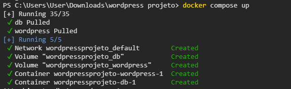
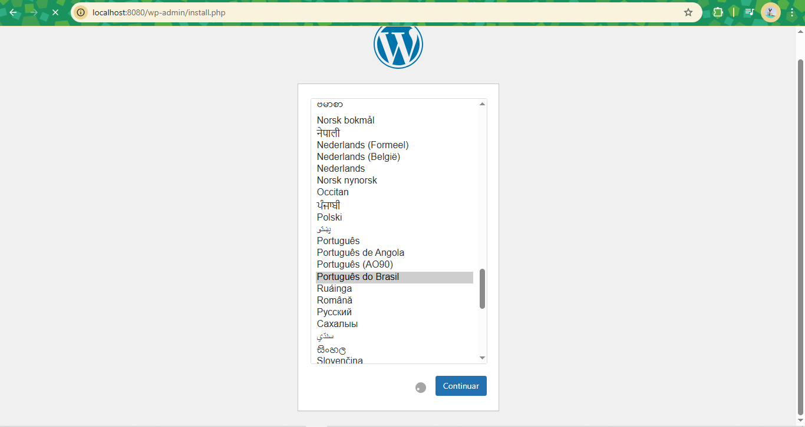
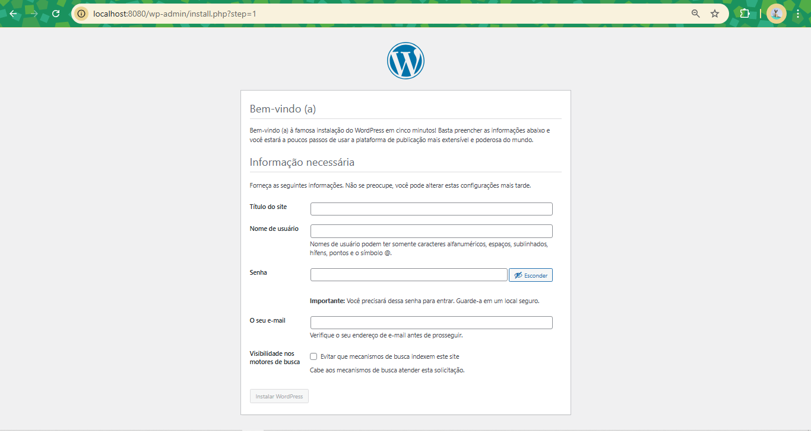
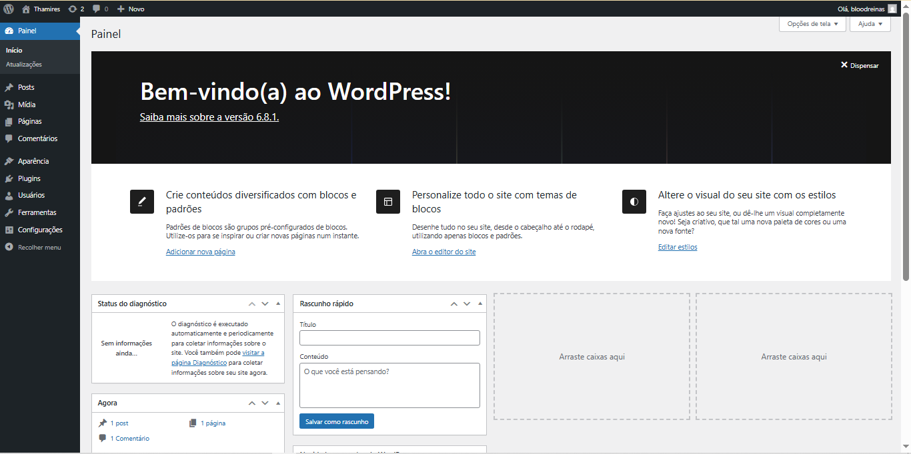

## Instalação do Wordpress na máquina local

1. Entrar em Docker hub e procurar pela imagem do Wordpress
2. Descer a página e copiar o código do docker compose
3. Abrir o terminal, digitar notepad compose.yaml ou abrir o bloco de notas e colar o código lá
4. Salvar o arquivo
5. Digitar docker compose up

6. Abrir o localhost:8080 no navegador

7. Adicionar suas informações na página de login

8. Depois de criado, acesse com seu login e senha

