## 1. instalação e configuração do DOCKER ou CONTAINERD no host EC2

## Criar uma VPC/Subnets
- Pesquise VPC na barra de pesquisa e selecione

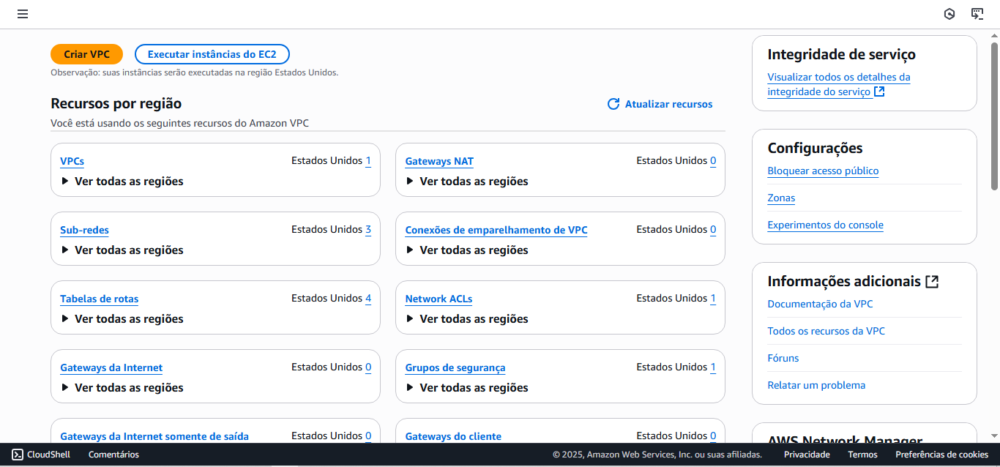

- Clique em VPC e Criar VPC

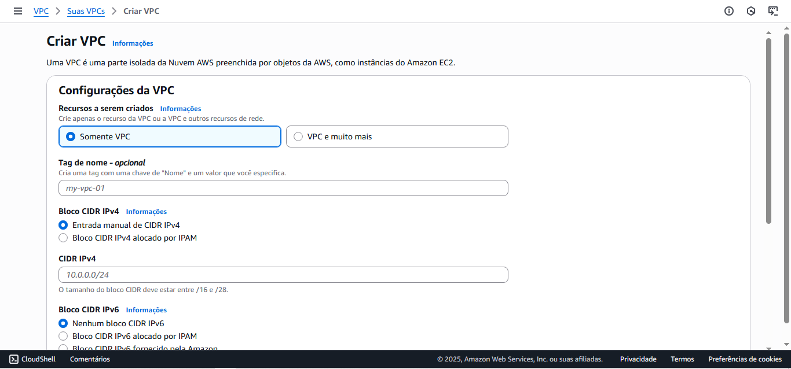

### Como configurar a VPC

> Primeiro, selecionar a região Norte da Vírgina (us-east-1)

1. Selecionar 'VPC e muito mais'
2. Geração automática da etiqueta de nome: selecione Gerar automaticamente
3. Bloco CIDR IPv4: defina o bloco de endereços IP
4. Bloco CIDR IPv6: selecione Nenhum bloco CIDR IPv6
5. Números de zonas de disponibilidade (AZs): selecionar duas zonas, e em 'Personalizar AZs' selecione us-east-1a e us-east-1b
6. Números de sub-redes públicas: selecione 2
7. Números de sub-redes privadas: selecione 2
8. Gateways NAT (USD): selecionar 'Nenhuma'
- Se optar por criar um gateway NAT na sua VPC, será cobrado por cada hora em que seu gateway NAT estiver provisionado e disponível. Também será cobrado pela quantidade de dados que passar pelo gateway.
9. Endpoints da VPC: selecionar 'S3 Gateway'
- Os endpoints podem ajudar a reduzir as cobranças do gateway NAT e melhorar a segurança acessando o S3 diretamente da VPC. Por padrão, a política de acesso integral será usada. Pode personalizar essa política a qualquer momento.
10. Clicar em 'Criar VPC'
11. Depois de criado, clique em 'Visualizar suA VPC'

# Criar Security Groups
- Antes de criar uma instância, é preciso configurar um Security Group (grupo de segurança) para controlar o tráfego de rede (permissões de entrada/saída)
- Em Rede e segurança, clicar em Security Groups

1. Acessar o Console AWS, pesquisar por 'Security Groups' e selecionar em 'Security Groups'
2. Clicar em 'Create Security Group'

## Configuração do Security Group

#### Grupo de segurança da EC2
1. Definir o nome do Security Group
2. Inserir uma descrição 
3. Selecionar a VPC 
4. Depois de criado, ir em 'Regras de entrada' e selecionar 'Add rules'
5. Clicar em 'Regras de entrada'
- Colocar as suas informações.

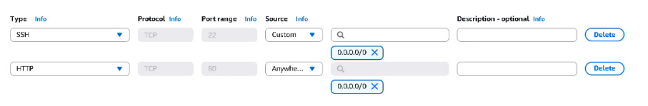

6. Clicar em 'Regras de Saída'
- Colocar as suas informações:

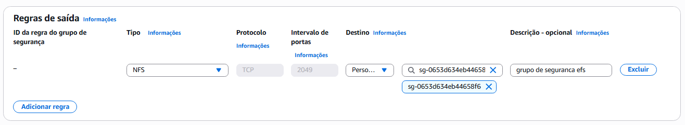

#### Grupo de segurança da RDS
1. Definir o nome do Security Group
2. Inserir uma descrição
3. Selecionar a VPC
4. Em 'Regras de entrada'
- Colocar essas informações:

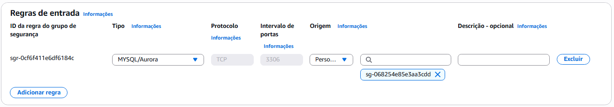

5. Clicar em 'Regras de Saída'
- Colocar essas informações:

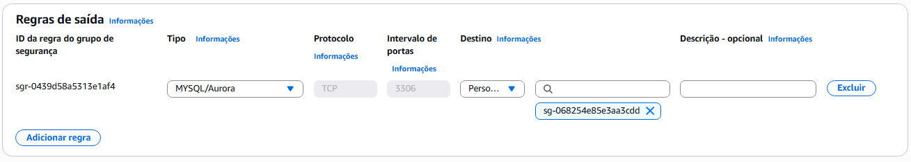

#### Grupo de segurança da EFS
1. Definir o nome do Security Group
2. Inserir uma descrição
3. Selecionar a VPC
4. Em Regras de entrada:
- Colocar essas informações:

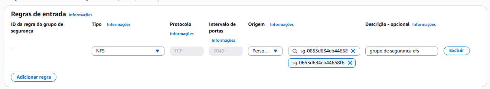

5. Em Regras de saída:
- Colocar essas informações:

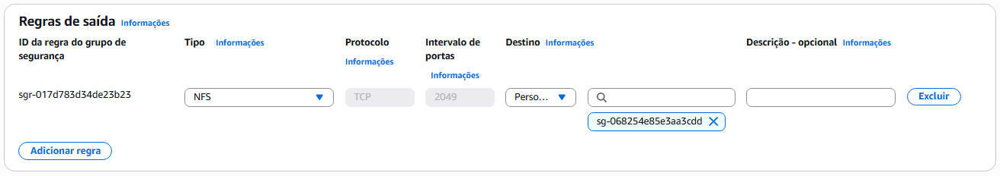

#### Grupo de segurança da Load Balancer
1. Definir o nome do Security Group
2. Inserir uma descrição
3. Selecionar a VPC
4. Em 'Regras de entrada'
- Colocar essas informações:

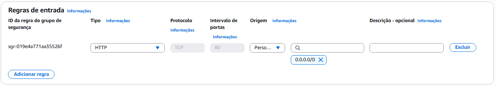

5. Em em 'Regras de Saída'
- Colocar essas informações:

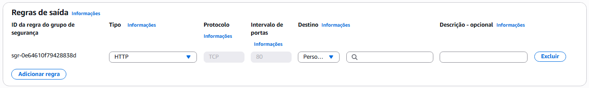

## Criando uma instância EC2

1. Na barra de pesquisa, pesquisar EC2
2. Clicar em 'Instâncias' e depois em 'Executar instâncias'

### Configurações
1. Nomes e tags: inserir um nome para sua instância
2. Descrição: inserir uma descrição 
3. Imagens de aplicação e de sistema operacional (imagem de máquina da Amazon): selecionar 'Ubuntu' ou 'Amazon Linux'

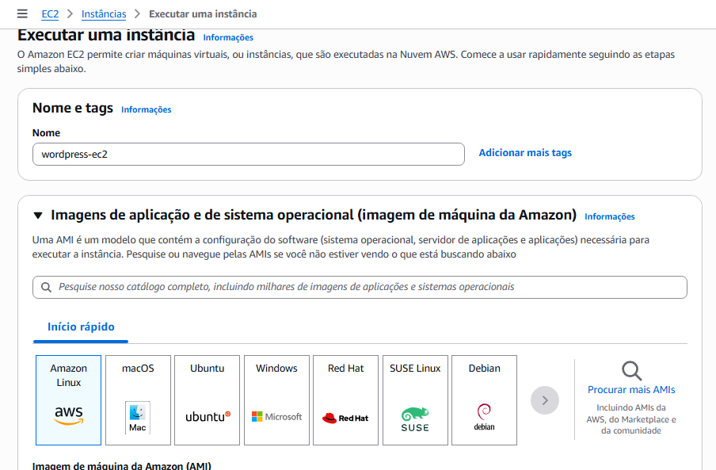

4. Tipo de instância: selecionar t2.micro
5. Par de chaves (login): selecionar a chave via SSH.
- Se não tiver uma, clique em 'Criar novo par de chaves'
- Nome: insira um nome para suas chaves
- Tipo de par de chaves: selecionar 'RSA'
- Formato de arquivo de chave privada: selecionar '.pem'

6. Configurações de rede: clique em 'Editar', selecione a VPC e a sub-rede pública com 'subnet-public1-us-east-1a' 
- Em Atribuir IP público automaticamente, selecione 'Habilitar'
- Em Firewall, selecionar 'Selecionar grupo de segurança existente' e depois selecione o grupo de segurança feita para EC2
7. Detalhes avançados: desça a página até 'Dados do usuário (opcional)' e cole o código do user_data ou deixe vazio.
8. Espere iniciar e clique em 'Conectar'
9. Em Conexão de instância do EC2, clique em 'Connect using a Public IP'
- Abrirá esse terminal se você selecionou 'Amazon Linux'

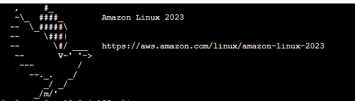

- Atualizar os pacotes do sistema
```bash
sudo yum update -y
```

- Se o Docker não estiver instalado:
```bash
sudo yum install -y docker
```

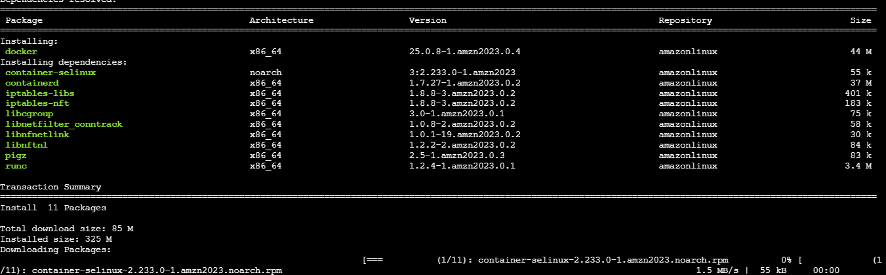

- Iniciar o serviço do Docker
```bash
sudo service docker start
```

- Checar se o Docker está funcionando
```bash
sudo service docker status
```

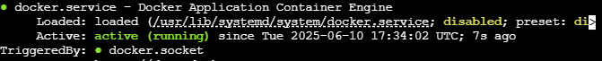

- Permita executar comands sem sudo
```bash
sudo usermod -a -G docker ec2-user
```

⚠️ Importante: Precisa sair e entrar novamente na sessão  para que a alteração de grupo tenha efeito.

- Rodar o Docker
```bash
docker ps 

docker run
```

9. Ir em 'Docker Hub' e pesquisar novamente a imagem do 'Wordpress'
- Copiar o código do 'Docker compose' 
- Usar o editor de sua preferência (vim ou nano) ou utilizar o cat <<EOF > compose.yml
- Nomear o arquivo como 'compose.yml'

```bash
#!/bin/bash
services:

  wordpress:
    image: wordpress
    restart: always
    ports:
      - 8080:80
    environment:
      WORDPRESS_DB_HOST: db
      WORDPRESS_DB_USER: exampleuser
      WORDPRESS_DB_PASSWORD: examplepass
      WORDPRESS_DB_NAME: exampledb
    volumes:
      - wordpress:/var/www/html

  db:
    image: mysql:8.0
    restart: always
    environment:
      MYSQL_DATABASE: exampledb
      MYSQL_USER: exampleuser
      MYSQL_PASSWORD: examplepass
      MYSQL_RANDOM_ROOT_PASSWORD: '1'
    volumes:
      - db:/var/lib/mysql

volumes:
  wordpress:
  db:
```

10. Baixar o Docker Compose
```bash
sudo curl -L "https://github.com/docker/compose/releases/download/v2.23.0/docker-compose-$(uname -s)-$(uname -m)" -o /usr/local/bin/docker-compose
```

11. Permissão e execução
```bash
sudo chmod +x /usr/local/bin/docker-compose
```

12. Verificar se o Docker Compose foi instalado corretamente
```bash
docker-compose --version
```
- Aparecerá algo como 'Docker Compose version v2.23.0'

13. Rodar o Docker compose
```bash
docker-compose up -d
```

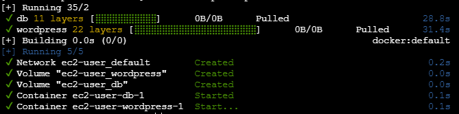