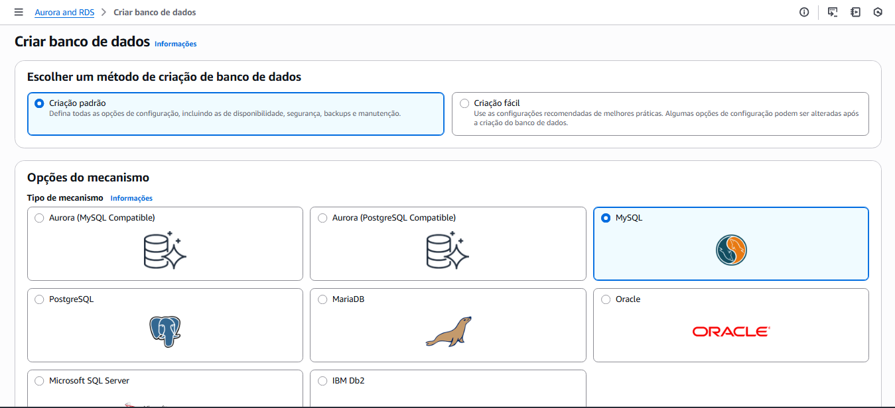
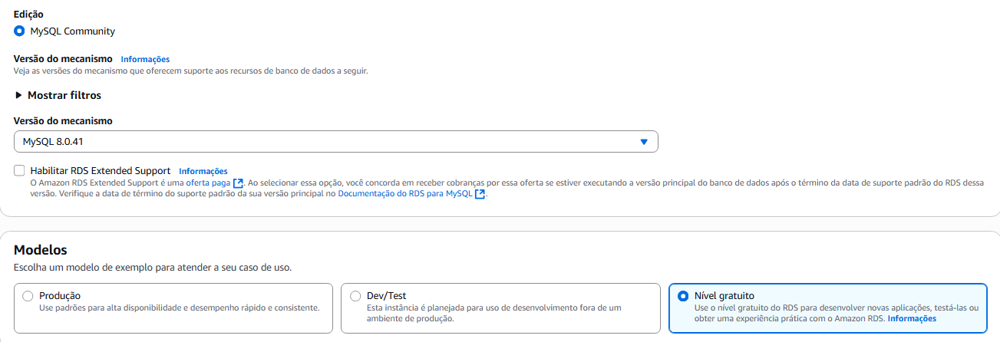
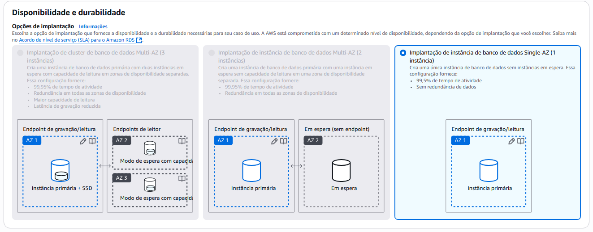
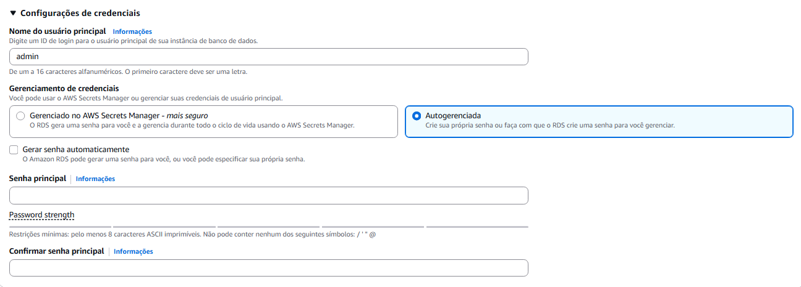
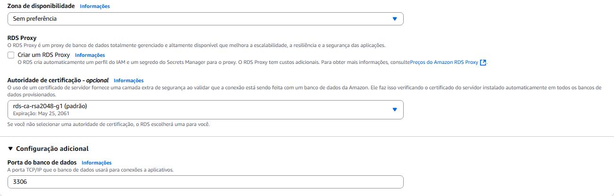
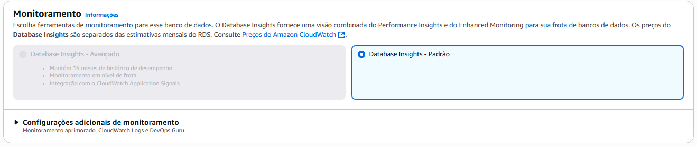
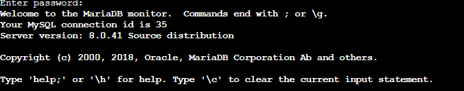
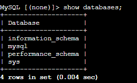
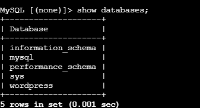

# 2. Efetuar Deploy de uma aplicação Wordpress com: container de aplicação RDS database Mysql

1. Pesquisar por RDS e selecionar 'Aurora and RDS'
2. Clicar em 'Criar banco de dados'
3. Escolher um método de criação de banco de dados: criação padrão
4. Opções de mecanismo: MySQL



5. Modelos: selecionar 'Nível gratuito'
6. Versões disponíveis: Aurora PostgreSQL



7. Disponibilidade e durabilidade:



8. Identificador da instância de banco de dados: criar um nome para o banco de dados
9. Nome do usuário principal: criar um nome de usuário
- No projeto, usei 'admin'
10. Gerenciamento de credenciais: selecionar Autogerenciada e depois criar uma senha segura



11. Classe da instância de banco de dados: selecionar Classes Optimized Reads - novo
- Selecionar a 'db.t3.micro'


12. Armazenamento:


13. Conectividade: 
- Selecionar 'Não se conectar a um recurso de computação do EC2'
- Selecionar 'IPv4'
- Selecionar a VPC criada anteriormente
- Em acesso público, selecionar 'Não'
- Em Grupo de segurança de VPC (firewall), selecionar 'Selecionar existente' (se já criado) ou 'Criar novo'



14. Em 'Autenticação de banco de dados', selecionar 'Autenticação de senha'


15. Monitoramento: selecionar 'Database Insights - Padrão'



16. Depois de criado, aguarde alguns segundos.
- Clique em cima do nome do seu banco de dados
17. Copie o endpoint
18. Abra o terminal do EC2 novamente
```bash
sudo yum install -y mariadb105
```

19. Depois de instalado, digite:
```bash
mysql -h SEU ENDPOINT AQUI -u admin -p
```
- Coloque a sua senha (Aquela que você colocou anteriormente em 'Gerenciamento de credenciais')

- Você verá a seguinte mensagem:



- Digitando 'show databases;'



20. Para criar um banco de dados, digitar:
```bash
create database wordpress
```
- Irá aparecer um >, você pode colocar informações nele ou colocar o caractere ';' e apertar 'Enter'

21. Digite 'show databases;' novamente e veja se o banco está lá



- Saia do terminal apertando CTRL + D

22. Digite 'docker compose down' 
23. Abra o arquivo 'compose.yml' e edite o arquivo:
```bash
      WORDPRESS_DB_HOST: db
      WORDPRESS_DB_USER: exampleuser
      WORDPRESS_DB_PASSWORD: examplepass
      WORDPRESS_DB_NAME: exampledb
```

- Em WORDPRESS_DB_HOST: colocar o link
- Em WORDPRESS_DB_USER: colocar o usuário que você escolheu
- Em WORDPRESS_DB_PASSWORD: colocar a senha que você escolheu
- Em WORDPRESS_DB_NAME: colocar o nome do banco de dados

24. Suba o banco de dados novamente com 'docker-compose up' e aguarde a instalação
