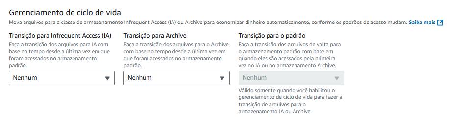
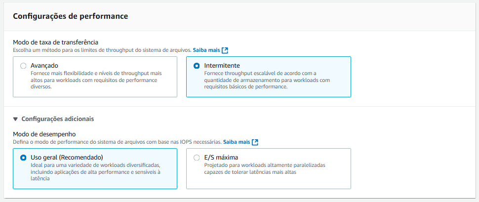
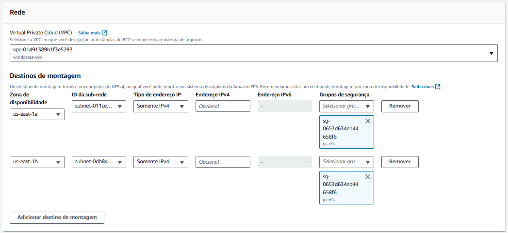

# Configuração da utilização do serviço EFS AWS para estáticos do container de aplicação Wordpress

1. Abrir a barra de pesquisa e digitar por 'EFS'
2. Clicar em 'Criar sistema de arquivos'

## Etapa 1: Configurações do sistema de arquivos
1. Clicar em 'Personalizar'
2. Nome: inserir um nome
3. Tipo de sistema de arquivos: selecionar 'One Zone' ou 'Regional'
- No nosso projeto, usaremos 'Regional' 
4. Backups automáticos: desmarcar o checkbox
5. Gerenciamento de ciclo de vida: colocar todas as opções para 'Nenhum'



6. Configurações de performance: selecionar 'Intermitente'
10. Configurações adicionais: selecionar 'Uso geral (Recomendado)'



11. Clicar em 'Próximo'

## Etapa 2: Acesso à rede 
1. Virtual Private Cloud (VPC): Selecionar a VPC 
2. Selecionar Availability Zones (AZs)
- Selecionar subnets privadas (subnet privada da us-east-1a e subnets **PRIVADAS** da us-east-1b)
3. Grupos de segurança: escolher o grupo de segurança EFS



4. Clicar em próximo

## Etapa 3: Política do sistema de arquivos / EFS
1. Ler as opções
2. Clicar em 'Próximo'

## Etapa 4: Revisar e criar
1. Revisar as opções
2. Clicar em 'Criar'

> Depois de criada, você irá anotar o ID do seu EFS para utilizá-lo futuramente.

# Launch Template / Modelos de Execução
1. Na barra de pesquisa, pesquisar EC2
2. Na lateral esquerda, clicar em 'Modelos de Execução' na seção 'Instâncias'

### Configurações
1. Nomes do modelo de execução: inserir um nome para o modelo
2. Descrição: inserir uma descrição 
3. Imagens de aplicação e de sistema operacional (imagem de máquina da Amazon): selecionar 'Ubuntu' ou 'Amazon Linux'
4. Tipo de instância: selecionar t2.micro
5. Par de chaves (login): selecionar a chave via SSH.
6. Configurações de rede: clique em 'Editar',
- Em Subent, selecione a opção 'Don't include in launch template
- Em Firewall, selecionar 'Selecionar grupo de segurança existente' e depois selecione o grupo de segurança feita para EFS
7. Detalhes avançados: desça a página até 'Dados do usuário (opcional)' e cole o código do user_data ou deixe vazio.

```bash
#!/bin/bash

# EFS, DB E PROJETO
EFS_FILE_SYSTEM_ID="<seu_file_id>"  
DB_HOST="<seu_host_do_banco_de_dados>"  
DB_NAME="<seu_nome_do_banco_de_dados>"  
DB_USER="<seu_usuario_do_banco>"  
DB_PASSWORD="<sua_senha_do_banco>"  
DOCKER_COMPOSE_VERSION="v2.34.0"
PROJECT_DIR="/home/ec2-user/projeto-docker"
EFS_MOUNT_DIR="/mnt/efs"  

# Atualizações e instalações básicas
yum update -y
yum install -y aws-cli

# Instalação e configuração do Docker
yum install -y docker
service docker start
systemctl enable docker
usermod -a -G docker ec2-user

# Instalação do Docker Compose
curl -SL https://github.com/docker/compose/releases/download/${DOCKER_COMPOSE_VERSION}/docker-compose-linux-x86_64 -o /usr/local/bin/docker-compose
chmod +x /usr/local/bin/docker-compose

# Instalação e montagem do EFS
yum install -y amazon-efs-utils
mkdir -p ${EFS_MOUNT_DIR}
mount -t efs ${EFS_FILE_SYSTEM_ID}:/ ${EFS_MOUNT_DIR}
echo "${EFS_FILE_SYSTEM_ID}:/ ${EFS_MOUNT_DIR} efs defaults,_netdev 0 0" >> /etc/fstab

# Permissões corretas para WordPress (usuário 33 = www-data no container)
chown -R 33:33 ${EFS_MOUNT_DIR}

# Preparação do projeto
mkdir -p ${PROJECT_DIR}
cd ${PROJECT_DIR}

# docker-compose.yml
cat > docker-compose.yml <<EOL
version: '3.7'
services:
  wordpress:
    image: wordpress:latest
    container_name: wordpress
    environment:
      WORDPRESS_DB_HOST: ${DB_HOST}
      WORDPRESS_DB_NAME: ${DB_NAME}
      WORDPRESS_DB_USER: ${DB_USER}
      WORDPRESS_DB_PASSWORD: ${DB_PASSWORD}
    ports:
      - 80:80
    volumes:
      - ${EFS_MOUNT_DIR}:/var/www/html

volumes:
  wordpress_data:
EOL

# Inicialização do WordPress
docker-compose up -d
```

- Adicione tags se necessário. No projeto, usarei as minhas.
8. Espere iniciar e clique em 'Conectar'
9. Em Conexão de instância do EC2, clique em 'Connect using a Public IP'

## Instalação do EFS

1. Para instalar o EFS:
```bash
sudo apt-get update
sudo apt-get -y install git binutils rustc cargo pkg-config libssl-dev
git clone https://github.com/aws/efs-utils
cd efs-utils
./build-deb.sh
sudo apt-get -y install ./build/amazon-efs-utils*deb
```

2. Para montar:
```bash
sudo mkdir -p /mnt/efs
sudo mount -t efs -o tls fs-12345678:/ /mnt/efs
```