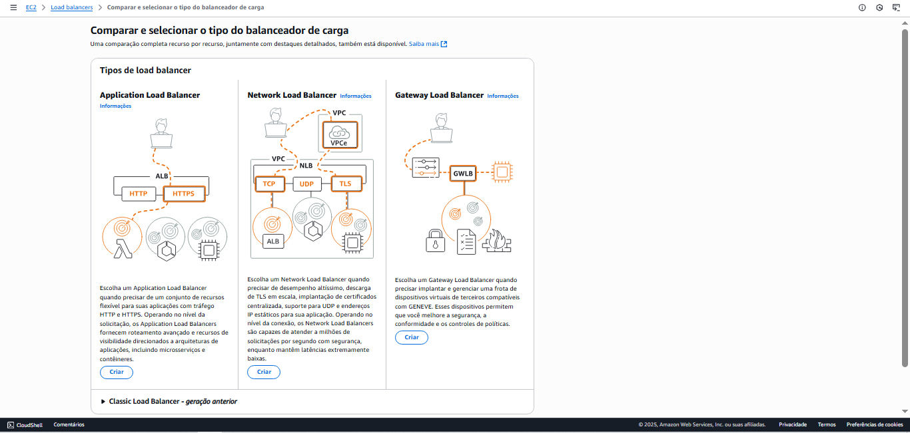
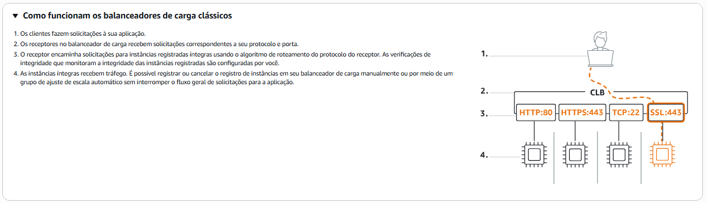
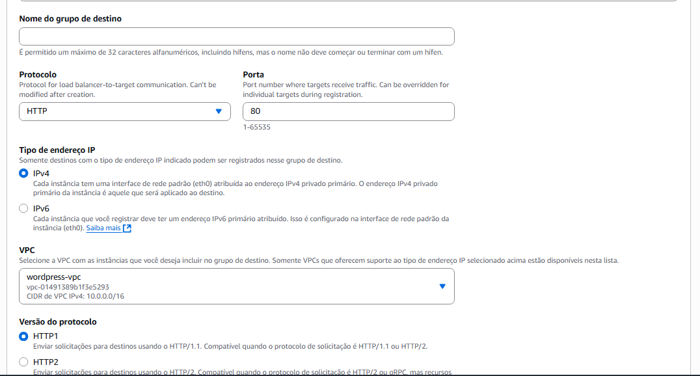
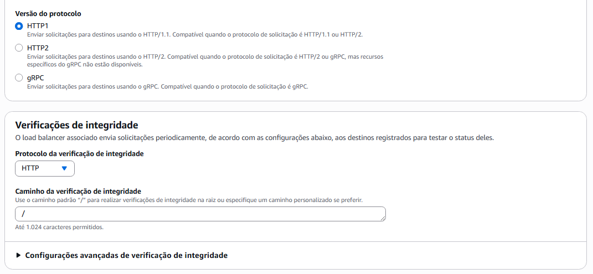

# Configuração do serviço de Load Balancer AWS para a aplicação Wordpress

## Criando o Load Balancer
1. Abrir a barra de pesquisa e pesquisar por 'Load Balancer'
2. Clicar em 'Load Balancer'

3. Clicar em 'Classic Load Balancer - geração anterior'
- Selecionar 'Criar'

4. Nome do load balancer: inserir um nome 
2. Esquema: 
3. VPC: Selecionar a VPC
4. Zonas de disponibilidade e subnets: inserir as subnets públicas
5. Grupos de segurança: selecionar o grupo de segurança

# Auto escaling grupo
1. Abrir a barra de pesquisa e pesquisar por Auto Scaling Groups
2. Clicar em 'Criar grupo do Auto Scaling'

### Etapa 1: Escolher o modelo de execução
1. Nome do grupo do Auto Scaling: inserir um nome para o grupo
2. Modelo de execução: Clicar no seu modelo de execução
3. Versão: escolher a versão

### Etapa 2: Escolher as opções de execução de instância
1. Selecionar a VPC
2. Selecionar as duas subnets privadas
3. Em Zonas de disponibilidade: selecionar 'Melhor esforço equilibrado'
4. Clicar em 'Próximo'

### Etapa 3: Integrar com outros serviços
1. Selecionar 'Anexar a um balanceador de carga existente'
2. Em 'Anexar a um balanceador de carga existente', selecionar 'Escolha entre balanceadores de carga clássicos'
- Selecionar o Load Balancer que foi configurado antes
3. Em 'Serviço VPC Lattice para anexar', selecionar 'Nenhum serviço VPC Lattice para anexar'
4. Em 'Verificações de saúde', selecionar o tempo 
5. Marcar o checkbox 'Ativar verificações de integridade do Elastic Load Balancing'
6. Clicar em 'Próximo'

### Etapa 4: Configurar tamanho do grupo e ajuste de escala
1. Em 'Tamanho do grupo':
- Capacidade desejada: 2
2. Em 'Scaling':
- Mínima capacidade desejada: 2
- Máxima capacidade desejada: 4
- Em 'Escala automática', selecionar 'Nenhuma política de dimensionamento'

### Etapa 5, 6 e 7: Adicionar notificações, Adicionar etiquetas e Análise
1. Leia as opções
2. Clique em 'Próximo'

# Scaling automático
1. Abrir a barra de pesquisa e pesquisar 'Auto scaling group'
2. Selecionar ele clicando no checkbox
3. Selecionar 'Scaling automático'
- Clicar em 'Criar política de dimensionamento dinâmico'

1. Na barra de pesquisa, digitar 'CloudWatch'
2. Clicar em 'Alarmes' e em 'Criar alarmes'

## Etapa 1: Especificar métrica e condições
1. Clicar em 'Selecionar métrica'
- Selecionar EC2
- Selecionar 'Por Auto Scaling Group' e AS6-Project02
2. Em 'Condições', selecione 'Estático' e embaixo 'GreateryEqual'
3. Clicar em 'Próximo'

## Etapa 2: 
1. Em 'Disparador de estado de alarme', selecionar 'Em alarme'
2. Em 'Enviar a notificação para', selecionar EC2 Auto Scaling Group
3. Selecionar o Auto Scaling Group criado antes
4. Selecionar 'Aplicar às 2 instâncias'

## Etapa 3:
1. Clicar em 'Próximo'

## Etapa 4:
1. Nome e descrição: inserir um nome para o alarme
2. Clicar em 'Próximo'

## Criando Target Groups / Grupo de destino

1. Na barra de pesquisa, pesquise por 'Target Groups'
2. Clicar em 'Criar grupo de destino'

## Configurações do Target Groups

### Etapa 1: Especificar detalhes do grupo

1. Escolher um tipo de destino: selecionar 'Instâncias'
2. Nome do grupo de destino: selecionar um nome 
3. Protocolo e Porta: selecionar 'HTTP' e '80', respectivamente.
4. Tipos de endereço IP: selecionar 'IPv4'
5. VPC: selecionar a VPC
6. Versão do protocolo: selecionar a 'HTTP1'

7. Verificações de integridade: 
- Em Protocolo da verificação de integridade: 'HTTP'
- Em Caminho da verificação de integridade: '/' 

### Etapa 2: Registrar destinos

1. Selecionar as instâncias com a porta '80'
2. Quando selecionar as instâncias, clique em 'Criar grupo de destino'