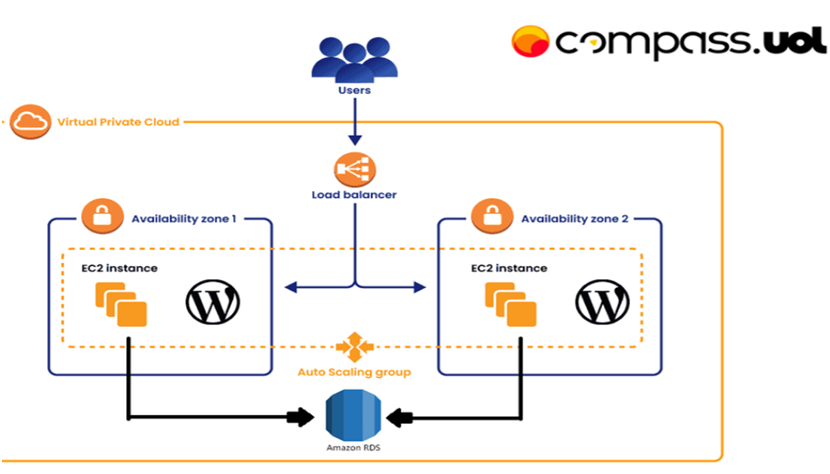

# Projeto 2 Turma ABR-25 Wordpress na AWS

Projeto que explica como implantar uma arquitetura escalável do WordPress na AWS usando:
- EC2 com Docker/containerd (via user_data.sh)
- RDS MySQL (banco de dados gerenciado)
- EFS (armazenamento compartilhado para arquivos do WordPress)
- Application Load Balancer (ALB) (balanceamento de carga)

## Etapas

1. [instalação e configuração do DOCKER ou CONTAINERD no host EC2](ETAPA-1.md)
- Ponto adicional para o trabalho utilizar a instalação via script deStart Instance (user_data.sh)
2. [Efetuar Deploy de uma aplicação Wordpress com container de aplicação RDS database Mysql](ETAPA-2.md)
3. [Configuração da utilização do serviço EFS AWS para estáticos do container de aplicação Wordpress](ETAPA-3.md)
4. [Configuração do serviço de Load Balancer AWS para a aplicação Wordpress](ETAPA-4.md)

### Referências

- [Como Hospedar um Site WordPress na AWS com EC2 e RDS](https://www.youtube.com/watch?v=gLGfMrNDSmU&t=454s&ab_channel=UDSTecnologia)
- [Configuração da rede privada (VPC) na AWS - Curso Prático Amazon Web Services](https://www.youtube.com/watch?v=WMsADIgy4ms)
- [Como criar uma VPC](https://docs.aws.amazon.com/pt_br/vpc/latest/userguide/create-vpc.html)
- [Hands-on: Launching a WordPress CMS Web Application on AWS](https://youtu.be/9Wg1pEft7Ns)
- [AWS Tutorial to create Application Load Balancer and Auto Scaling Group](https://www.youtube.com/watch?v=fZuxp_pOzgI&ab_channel=CloudChamp)